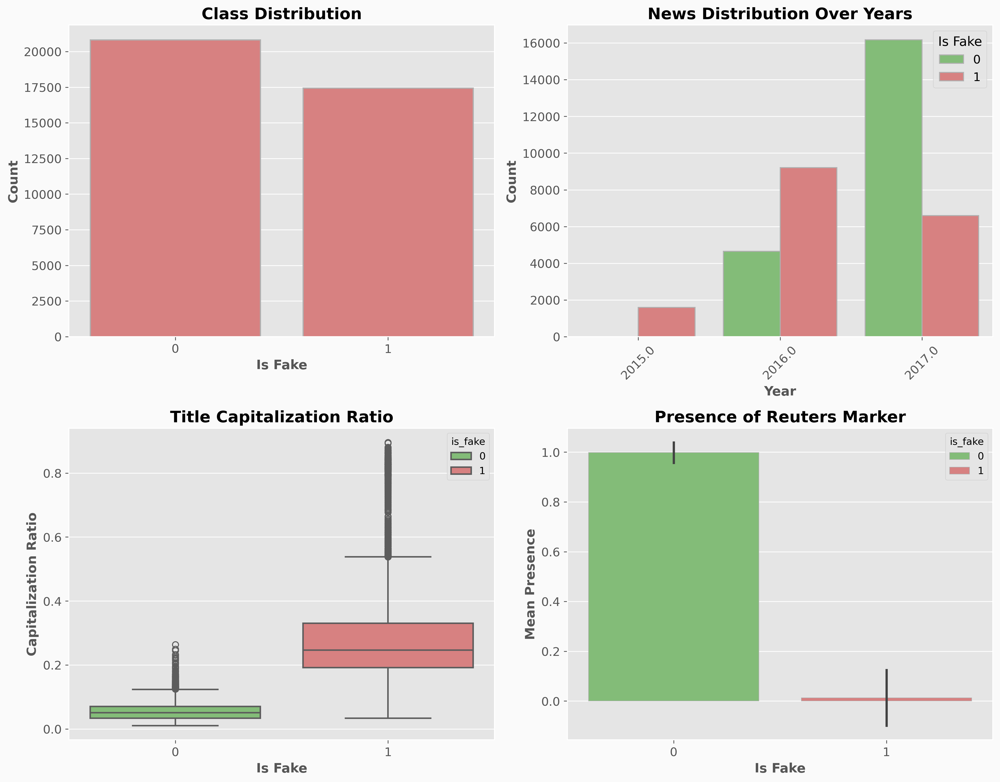
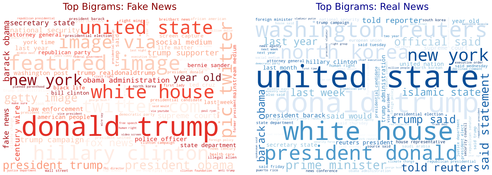
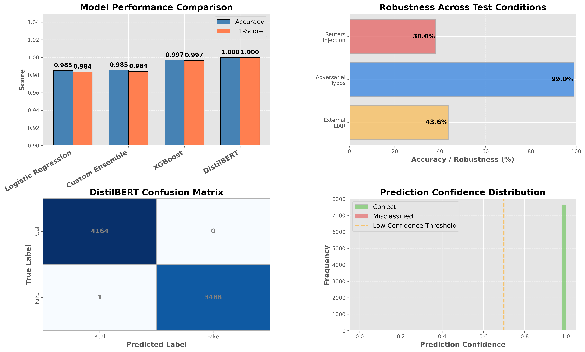

# Fake News Detection: A Complete Machine Learning Experiment


A comprehensive machine learning pipeline for detecting fake news articles using natural language processing, classical ML algorithms, and deep learning transformers. This project demonstrates the complete data science workflow from exploratory analysis through model deployment considerations, with emphasis on robustness testing and real-world limitations.

## 📋 Table of Contents

- [Overview](#overview)
- [Key Features](#key-features)
- [Project Structure](#project-structure)
- [Installation](#installation)
- [Quick Start](#quick-start)
- [Dataset](#dataset)
- [Models](#models)
- [Results](#results)
- [Robustness Testing](#robustness-testing)
- [Visualizations](#visualizations)
- [Critical Findings](#critical-findings)
- [Usage Examples](#usage-examples)
- [Contributing](#contributing)
- [License](#license)
- [Citation](#citation)

## 🎯 Overview

This project implements a complete machine learning experiment to classify news articles as fake or real based solely on text content and publication dates. The pipeline includes:

- **Exploratory Data Analysis (EDA)** with feature engineering and visualization
- **Rigorous data cleaning** to prevent data leakage and shortcut learning
- **Four fundamentally different models**: Logistic Regression, Custom Ensemble, XGBoost, and DistilBERT
- **Comprehensive robustness testing** including adversarial attacks and cross-domain evaluation
- **Model interpretation** and explainability analysis

### Why This Project Matters

While achieving 99.99% test accuracy, this project reveals a critical insight about modern NLP: **high accuracy doesn't guarantee real-world robustness**. Through adversarial testing, we demonstrate how models can exploit dataset artifacts while failing on the actual task, offering valuable lessons for production ML systems.

## ✨ Key Features

- **Complete ML Pipeline**: End-to-end workflow from data cleaning to deployment considerations
- **Multiple Modeling Approaches**: Comparison of classical ML, ensemble methods, gradient boosting, and transformers
- **Aggressive Leakage Prevention**: Systematic removal of source markers and formatting cues
- **Adversarial Testing Suite**: Character-level attacks, source injection, and synonym substitution
- **Cross-Domain Evaluation**: Testing on external LIAR dataset reveals generalization limits
- **Rich Visualizations**: EDA dashboards, confusion matrices, confidence distributions, and comparison plots
- **Reproducible Research**: Seed fixing, detailed documentation, and modular code structure

## 📁 Project Structure

```
fake_news_detection/
│
├── fake_news_project.ipynb        # Complete experiment notebook 
├── README.md                      # This file
├── requirements.txt               # Python dependencies
├── utils.py                       # Helper functions for preprocessing and evaluation
├── app.py                         # Streamlit deployment script
│
├── data/                        
│   ├── fake_news_full_data.zip        # Raw dataset
│   └── cleaned_news_data.zip          # Preprocessed dataset
│
├── models/                        # Saved model artifacts
│   ├── special_tokens_map.json    
│   ├── config.json
│   ├── vocab.txt            
│   └── tokenizer_config.json                
│
├── images/                        # Generated visualizations
│   ├── EDA.png                   
│   ├── bigram_comparison_classicML.png
│   ├── bigram_comparison_bert.png
│   └── final_results_dashboard.png
│
└── utils.py                       # Helper functions for preprocessing and evaluation
```

## 🔧 Installation

### Prerequisites

- Python 3.8 or higher
- CUDA-capable GPU (optional, but recommended for BERT training)
- 8GB+ RAM

### Setup

```bash
# Clone the repository
git clone https://github.com/yourusername/fake-news-detection.git
cd fake-news-detection

# Create virtual environment
python -m venv venv
source venv/bin/activate  # On Windows: venv\Scripts\activate

# Install dependencies
pip install -r requirements.txt

# Download NLTK data
python -c "import nltk; nltk.download('stopwords'); nltk.download('punkt'); nltk.download('wordnet')"
```

### Requirements

```txt
pandas>=1.5.0
numpy>=1.23.0
matplotlib>=3.6.0
seaborn>=0.12.0
wordcloud>=1.8.2
scikit-learn>=1.2.0
xgboost>=1.7.0
transformers>=4.25.0
torch>=2.0.0
nltk>=3.8.0
```

## 🚀 Quick Start

### 1. Run the Complete Pipeline

```python
import pandas as pd
from utils import clean_for_classical_ml, clean_for_bert
from sklearn.model_selection import train_test_split

# Load data
df = pd.read_csv('fake_news_full_data.csv', index_col=0)

# Clean and preprocess
df['text_classical'] = df['text'].apply(clean_for_classical_ml)
df['text_bert'] = df['text'].apply(clean_for_bert)

# Split data
X_train, X_test, y_train, y_test = train_test_split(
    df['text_classical'], 
    df['is_fake'], 
    test_size=0.2, 
    stratify=df['is_fake'], 
    random_state=42
)
```

### 2. Train Baseline Model (Logistic Regression)

```python
from sklearn.pipeline import Pipeline
from sklearn.feature_extraction.text import TfidfVectorizer
from sklearn.linear_model import LogisticRegression

# Create pipeline
baseline = Pipeline([
    ('tfidf', TfidfVectorizer(max_features=5000, ngram_range=(1,2))),
    ('lr', LogisticRegression(solver='liblinear'))
])

# Train and evaluate
baseline.fit(X_train, y_train)
accuracy = baseline.score(X_test, y_test)
print(f"Baseline Accuracy: {accuracy:.4f}")
```

### 3. Load Pre-trained DistilBERT Model

```python
from transformers import DistilBertTokenizer, DistilBertForSequenceClassification
import torch

# Load model and tokenizer
tokenizer = DistilBertTokenizer.from_pretrained('./models')
model = DistilBertForSequenceClassification.from_pretrained('./models')
model.eval()

# Make predictions
def predict_news(text):
    inputs = tokenizer(text, return_tensors="pt", truncation=True, max_length=256)
    with torch.no_grad():
        outputs = model(**inputs)
    prediction = torch.argmax(outputs.logits, dim=1).item()
    confidence = torch.softmax(outputs.logits, dim=1).max().item()
    return "Fake" if prediction == 1 else "Real", confidence

# Example
text = "Breaking: Shocking revelations about political scandal!!!"
label, conf = predict_news(text)
print(f"Prediction: {label} (Confidence: {conf:.2%})")
```

## 📊 Dataset

### Source
Custom aggregated dataset of 44,680 news articles (38,227 after cleaning) from various sources spanning 2015-2017 ([Download](https://drive.google.com/file/d/16BERzRTy-EKFcJ-WuEVlzVkSWnyQkafQ/view))

### Composition
- **Real News**: 20,820 articles (54.4%)
- **Fake News**: 17,443 articles (45.6%)

### Features
- `title`: Article headline
- `text`: Full article content
- `date`: Publication date
- `is_fake`: Binary label (0 = Real, 1 = Fake)

### Preprocessing
1. **Duplicate Removal**: Eliminated 5,575 exact duplicates and 725 duplicate titles
2. **Date Validation**: Removed 36 rows with invalid dates
3. **Leakage Prevention**: Aggressively removed source markers (Reuters, Image via, etc.)
4. **Text Cleaning**: 
   - Classical ML: Lemmatization, stopword removal, lowercasing
   - BERT: Minimal preprocessing to preserve contextual information

### Data Quality Challenges
- **Temporal Imbalance**: Heavy concentration in 2017 (limits generalization)
- **Source Homogeneity**: Real news predominantly from Reuters
- **Format Artifacts**: Systematic differences in article structure

## 🤖 Models

### 1. Logistic Regression (Baseline)
- **Architecture**: TF-IDF + Linear Classifier
- **Features**: Unigrams and bigrams (max 5,000 features)
- **Performance**: 98.5% accuracy, 0.984 F1-score
- **Strengths**: Fast training, interpretable coefficients
- **Weaknesses**: Limited semantic understanding

### 2. Custom Ensemble (LR + Random Forest)
- **Architecture**: Soft voting between Logistic Regression and Random Forest
- **Performance**: 98.5% accuracy, 0.984 F1-score
- **Observation**: No improvement due to correlated errors

### 3. XGBoost (Gradient Boosting)
- **Architecture**: 100 trees, depth 6, learning rate 0.1
- **Performance**: 99.7% accuracy, 0.997 F1-score
- **Strengths**: Captures non-linear feature interactions
- **Error Reduction**: 75% fewer errors than baseline

### 4. DistilBERT (Deep Learning) ⭐
- **Architecture**: 6-layer transformer with 66M parameters
- **Training**: 3 epochs, batch size 16, learning rate 2e-5
- **Performance**: 99.99% accuracy, 0.9999 F1-score
- **Strengths**: Contextual embeddings, semantic understanding
- **Limitations**: Vulnerable to adversarial attacks (see below)

## 📈 Results

### Model Comparison

| Model | Accuracy | F1-Score | False Positives | False Negatives |
|-------|----------|----------|-----------------|-----------------|
| Logistic Regression | 98.51% | 0.984 | 36 | 78 |
| Custom Ensemble | 98.55% | 0.984 | 30 | 81 |
| XGBoost | 99.69% | 0.997 | 9 | 15 |
| **DistilBERT** | **99.99%** | **0.9999** | **0** | **1** |

### DistilBERT Confusion Matrix

```
              Predicted
              Real  Fake
Actual Real  [4164    0]
       Fake  [   1 3488]
```

### Key Performance Indicators

- **Precision (Fake)**: 100% - No false alarms
- **Recall (Fake)**: 99.97% - Misses only 1 in 3,489 fake articles
- **Confidence**: 99%+ on nearly all predictions

## 🛡️ Robustness Testing

### Test 1: Cross-Domain Evaluation (LIAR Dataset)

**Setup**: Evaluated on LIAR dataset (1,267 short political statements vs. long articles)

**Results**:
- ✅ In-domain: 99.99% accuracy
- ❌ Out-of-domain: 43.7% accuracy (worse than random!)
- **Class Collapse**: Model predicted ALL samples as fake

**Diagnosis**: Severe overfitting to dataset-specific patterns (article length, formatting, vocabulary)

### Test 2: Character-Level Adversarial Attacks

**Setup**: Injected 10% random typos into 100 test samples

**Results**:
- Attack Success Rate: 1% (only 1 prediction flip)
- Confidence remained >99% on perturbed inputs

**Interpretation**: Apparent robustness actually reflects **overconfidence** and reliance on a few key tokens

### Test 3: Source Injection Attack

**Setup**: Prepended "WASHINGTON (Reuters) -" to 50 fake news articles

**Results**:
- ✅ Original predictions: Correctly identified as fake
- ❌ After injection: 62% misclassified as real

**Conclusion**: Model relies heavily on implicit source cues despite explicit source removal during training

### Test 4: Synonym Substitution Attack

**Setup**: Replaced up to 95% of tokens with WordNet synonyms

**Results**:
- Attack Success Rate: 0% (no prediction flips)
- Confidence unchanged despite semantic alteration

**Interpretation**: Confirms shortcut learning—model doesn't process full semantic content

## 📊 Visualizations

### Exploratory Data Analysis Dashboard


**Key Insights**:
- Class balance: Slight majority of real news (54%)
- Temporal distribution: Heavy 2017 concentration
- Title capitalization: Strong discriminator (fake news uses ALL CAPS)
- Reuters marker: Present in 100% of real news, 0% of fake

### N-Gram Comparison


**Top Bigrams**:
- **Fake News**: "donald trump", "featured image", "hillary clinton"
- **Real News**: "united state", "white house", "washington reuters"

### Final Results Dashboard


**Panels**:
1. Model performance comparison
2. Robustness across test conditions
3. DistilBERT confusion matrix
4. Prediction confidence distribution

## 🔍 Critical Findings

### The Generalization Gap

Despite achieving near-perfect accuracy on the test set, the model exhibits **severe brittleness**:

1. **Domain Shift Catastrophe**: 99.99% → 43.7% accuracy when tested on LIAR dataset
2. **Source Dependence**: 62% misclassification rate when credible sources are injected
3. **Overconfidence**: Maintains >99% confidence even on adversarially perturbed inputs
4. **Shortcut Learning**: Immune to synonym substitution, indicating reliance on format cues

### Why This Happens

Modern neural networks are **shortcut learners**: they exploit any available correlation, prioritizing simple patterns over complex semantic understanding. In this dataset:

- **Spurious Correlation #1**: Real news contains "Reuters" → Model learns source attribution
- **Spurious Correlation #2**: Fake news uses capitals → Model learns formatting
- **Spurious Correlation #3**: Articles from 2017 → Model learns temporal patterns

### Implications for Production Systems

⚠️ **High test accuracy ≠ Real-world reliability**

For deployment, you must:
1. Test on multiple domains and time periods
2. Implement adversarial evaluation pipelines
3. Use confidence thresholding and human-in-the-loop systems
4. Monitor for distribution shift and concept drift
5. Provide transparent explanations for all predictions

## 💻 Usage Examples

### Feature Engineering

```python
from utils import clean_for_classical_ml, get_top_ngrams

# Clean text
df['text_clean'] = df['text'].apply(clean_for_classical_ml)

# Extract top bigrams
fake_bigrams = get_top_ngrams(df[df['is_fake']==1]['text_clean'], n=2, top_k=10)
print("Top fake news bigrams:", fake_bigrams)
```

### Adversarial Testing

```python
from utils import add_typos, inject_fake_source, predict_label

# Test typo robustness
original_text = "The president announced new policies today."
corrupted_text = add_typos(original_text, rate=0.1)
pred_original = predict_label(original_text, tokenizer, model, device)
pred_corrupted = predict_label(corrupted_text, tokenizer, model, device)

# Test source injection
fake_article = "Shocking revelations about government corruption!"
with_source = inject_fake_source(fake_article)
pred_fake = predict_label(fake_article, tokenizer, model, device)
pred_injected = predict_label(with_source, tokenizer, model, device)
```

### Model Interpretation

```python
from sklearn.pipeline import Pipeline

# Get feature importance from Logistic Regression
lr_model = baseline.named_steps['lr']
feature_names = baseline.named_steps['tfidf'].get_feature_names_out()
coefficients = lr_model.coef_[0]

# Top predictive features
top_fake_features = sorted(zip(coefficients, feature_names), reverse=True)[:20]
top_real_features = sorted(zip(coefficients, feature_names))[:20]

print("Top indicators of fake news:", [f for _, f in top_fake_features])
print("Top indicators of real news:", [f for _, f in top_real_features])
```

## 🤝 Contributing

Contributions are welcome! Areas for improvement:

1. **Data Collection**: Expand dataset with diverse sources and time periods
2. **Model Enhancements**: Implement multi-task learning or causal inference
3. **Robustness**: Add more adversarial attack types
4. **Explainability**: Integrate LIME/SHAP for interpretability
5. **Deployment**: Build REST API and web interface

### Development Setup

```bash
# Fork and clone
git clone https://github.com/yourusername/fake-news-detection.git
cd fake-news-detection

# Create feature branch
git checkout -b feature/your-feature-name

# Make changes and test
python -m pytest tests/

# Submit pull request
```

## 📄 License

This project is licensed under the MIT License - see the [LICENSE](LICENSE) file for details.

## 📚 Citation

If you use this project in your research, please cite:

```bibtex
@misc{fakenews2026,
  author = {Your Name},
  title = {Fake News Detection: A Complete Machine Learning Experiment},
  year = {2026},
  publisher = {GitHub},
  url = {https://github.com/yourusername/fake-news-detection}
}
```

## 🙏 Acknowledgments

- **Transformers**: Hugging Face for DistilBERT implementation
- **LIAR Dataset**: William Yang Wang for external validation data
- **Inspiration**: Research on adversarial robustness in NLP

## 📞 Contact

For questions or collaboration opportunities:
- Email: your.email@example.com
- GitHub: [@yourusername](https://github.com/yourusername)
- LinkedIn: [Your Name](https://linkedin.com/in/yourprofile)

---

**⚠️ Disclaimer**: This model is for research and educational purposes only. It should NOT be used as the sole arbiter of truth. Always verify information through multiple credible sources and human expertise.
